# NeuralSearch

AI-powered document search system that supports:

- PDF Search
- DOCX Search
- TXT Search
- Image OCR Search

Technologies:
- EasyOCR
- Tesseract OCR
- Sentence Transformers
- RapidFuzz
- Cosine Similarity

Features:
- Semantic Search
- Fuzzy Search
- File Name Search
- Persistent Indexing

## Deployment (Docker)

One command gives an HTTPS-served CogniSeek: Caddy (the only public entry, ports 80/443) serves the
frontend and proxies `/api/*` to the backend; Postgres, Qdrant and Redis are on an internal network
with no published ports.

```bash
git clone <repo> cogniseek && cd cogniseek
cp .env.example .env
python scripts/generate_secrets.py        # fills every REQUIRED secret; prints key names only
docker compose up -d --build              # first start downloads the AI models (~2 GB)
docker compose ps                         # wait until backend and caddy are "healthy"
```

Open **https://localhost** (Caddy's internal CA: accept the certificate warning, or trust it with
`docker compose exec caddy caddy trust`). For a public server set `DOMAIN=search.example.com` and
`TLS=<your e-mail>` in `.env`; Caddy then gets a Let's Encrypt certificate and sends HSTS.

- **Indexing local folders:** the backend sees `LOCAL_DATA_DIR` (default `./sample-data`, read-only)
  as `/data`. Register `/data` or a sub-folder (e.g. `/data/notes`) on the Platforms page; paths are
  container paths, not host paths.
- **Google Drive / GitHub:** put the OAuth client files in `./credentials/` (mounted read-only) and
  register these callback URLs: `https://<DOMAIN>/api/platforms/google-drive/callback` and
  `https://<DOMAIN>/api/platforms/github/callback`.
- **GPU (NVIDIA):** `docker compose -f docker-compose.yml -f docker-compose.gpu.yml up -d --build`
  (CUDA torch build + one reserved GPU; needs the NVIDIA Container Toolkit).
- **Health:** `/api/health` is liveness (process up), `/api/ready` checks Postgres, Qdrant, Redis and
  the models; compose healthchecks use readiness, so Caddy starts only once the API can serve.
- **Metrics:** `GET /metrics` (Prometheus) is reachable only inside the Docker network; Caddy answers
  404 for `/api/metrics`. Scrape `backend:8000/metrics` from a container on the `data` network.
- **One uvicorn worker** (`WORKERS=1`): the indexing worker runs inside the API process and the models
  are loaded once per process, so more workers would compete for the queue and multiply model memory.
- **Upgrades:** `git pull && docker compose up -d --build` (the backend runs `alembic upgrade head`
  on start).
- Security model and hardening notes: [SECURITY.md](SECURITY.md).

### Backups

`docker compose run --rm backup` writes `./backups/cogniseek-<UTC>.tar.enc`: a `pg_dump` of the
database plus a snapshot of every Qdrant collection, encrypted with `BACKUP_ENCRYPTION_KEY` (keep a
copy of that key off the machine - without it the backups cannot be restored). The newest
`BACKUP_KEEP` (default 14) archives are kept.

```bash
docker compose run --rm backup python3 /scripts/restore.py --dry-run /backups/<file>   # verify only
```

Schedule it daily, e.g. with cron on the Docker host (copy the archives off-site as well):

```cron
30 3 * * *  cd /opt/cogniseek && docker compose run --rm backup >> backups/backup.log 2>&1
```

On Windows use Task Scheduler with the same command. A restore into a scratch database and collection
prefix (safe to run any time) and the full disaster-recovery steps are in `scripts/restore.py --help`.

## Development (non-Docker)

The original setup stays as it was: Postgres and Qdrant in Docker, the backend and the Vite dev
server on the host.

```bash
docker compose -f docker-compose.dev.yml up -d   # postgres :5432 + qdrant :6333 (127.0.0.1 only)
venv\Scripts\alembic upgrade head
venv\Scripts\uvicorn app.main:app --port 8000   # http://127.0.0.1:8000
cd frontend && npm run dev                      # http://127.0.0.1:3000
```

`ENV=development` needs no Redis (in-memory rate limits) and no Qdrant API key; missing JWT/Fernet
keys are generated per run with a warning. `docker-compose.override.example.yml` publishes the data
services of the *Docker* stack on 127.0.0.1 for debugging (copy it to `docker-compose.override.yml`).

> **Note:** `docker compose up` without `-f` now starts the production stack (project `cogniseek`,
> separate volumes). It never touches the development containers (project `omniseach-ai`).

## Screenshots

Captured by `frontend/e2e/screenshots.ts`, which walks a throwaway demo account (sample notes and
stock photos only) through the real flow and deletes it afterwards.

| Sign in | Onboarding 1: connect platforms | Onboarding 2: choose the priority platform |
|---|---|---|
| 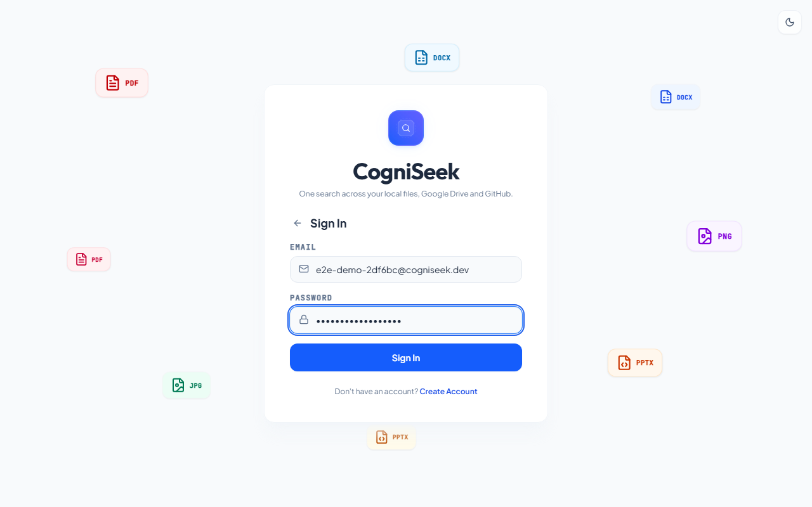 | 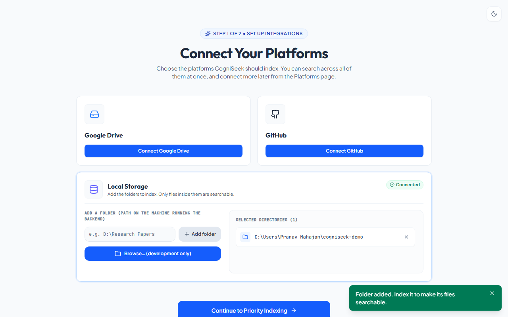 | 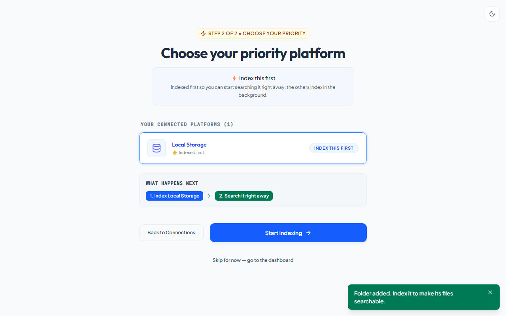 |
| **Dashboard while the priority platform indexes** | **Indexing Center (running)** | **Indexing Center (done, dark)** |
| 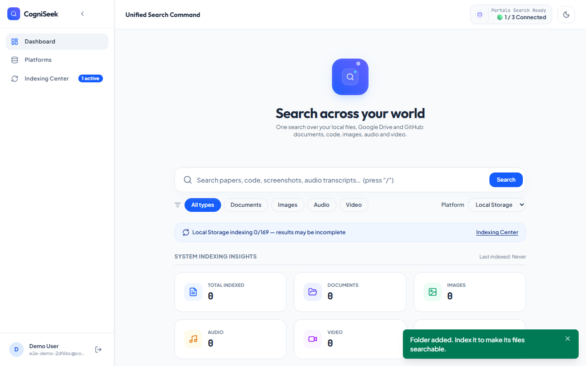 | 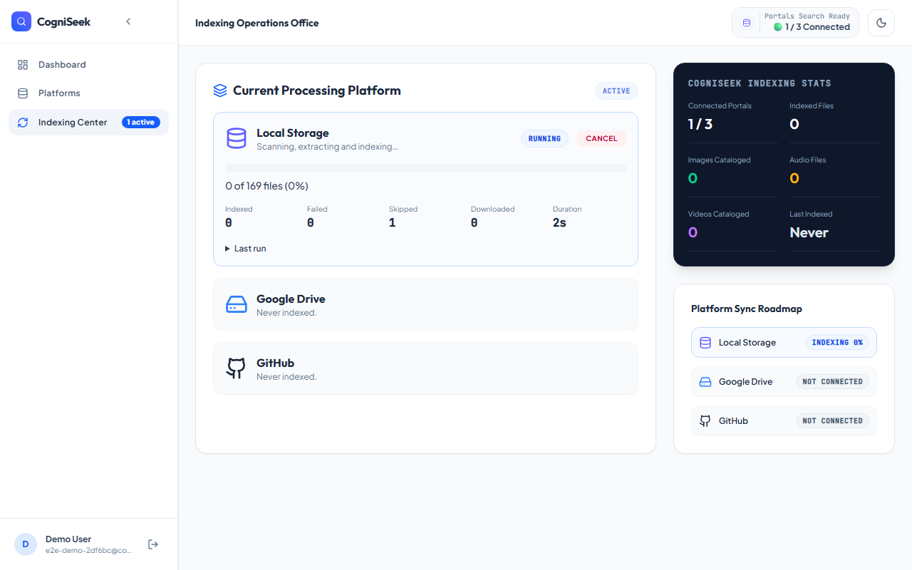 | 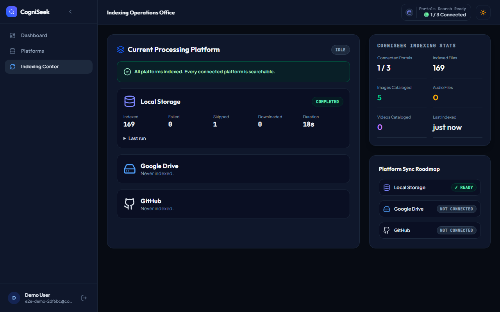 |
| **Dashboard** | **Document query (highlighted passage)** | **Visual query "dog" (no query word in the file name)** |
| 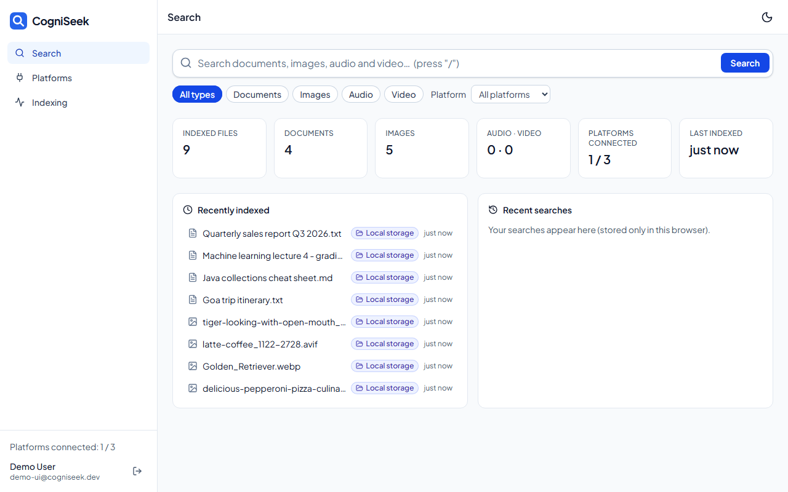 | 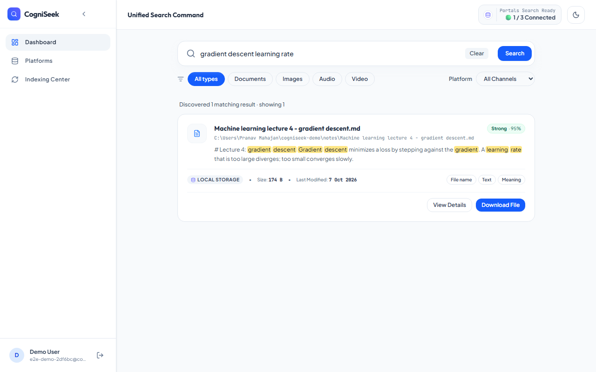 | 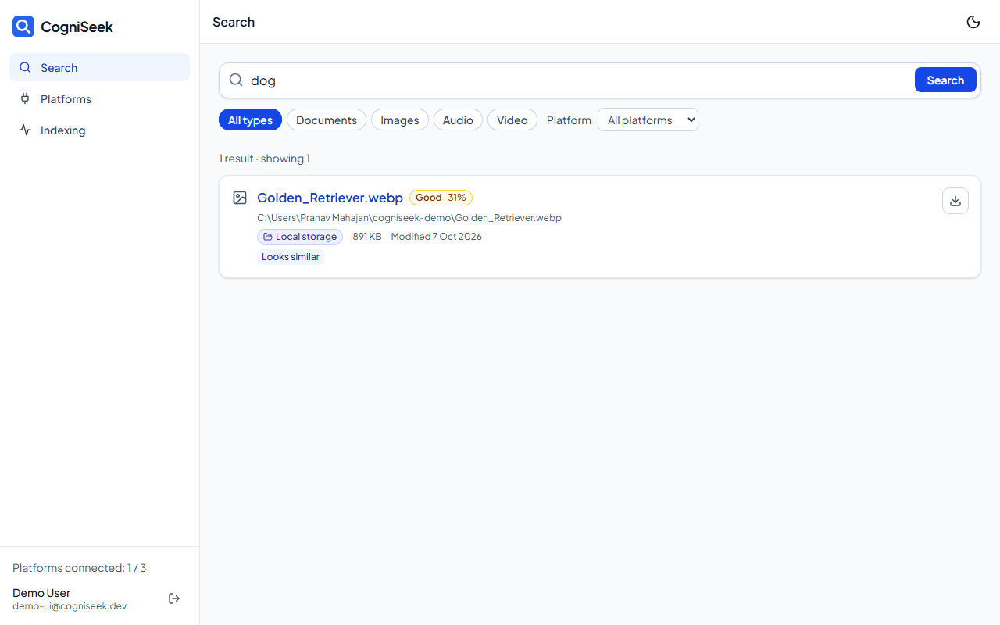 |
| **No results** | **Platforms** | **Platforms (dark)** |
| 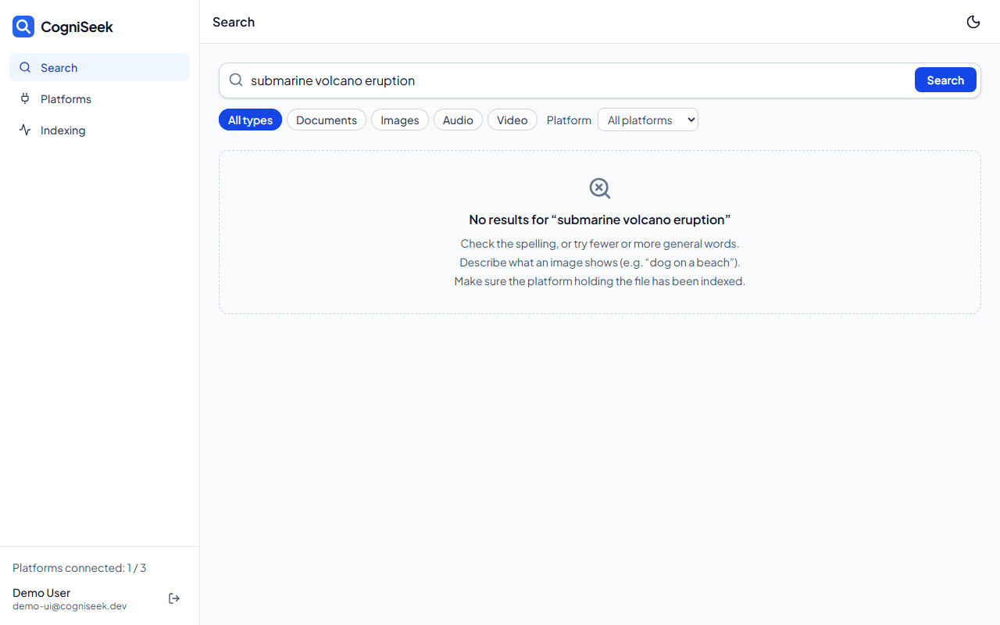 | 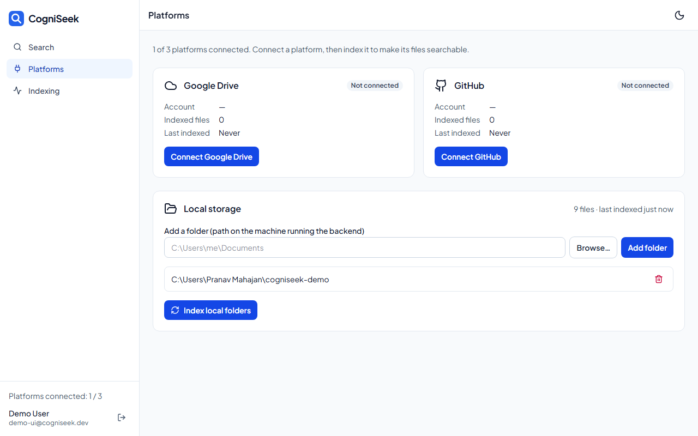 | 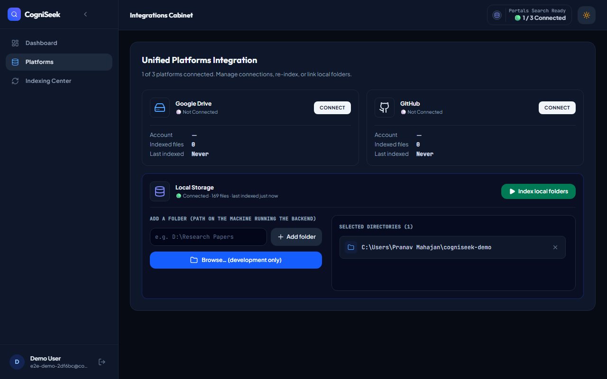 |

Also: [visual query in dark mode](docs/screenshots/search-visual-dog-dark.png),
[mobile (375 px, dark)](docs/screenshots/mobile-dashboard-dark.png), [Indexing Center (light)](docs/screenshots/indexing-center.png).

## Frontend

React 19 + TypeScript + Vite + Tailwind, TanStack Query for server state, React Router.

```bash
cd frontend
npm install
npm run dev          # http://127.0.0.1:3000 - fails (strictPort) if the port is taken
```

Open the app at **http://127.0.0.1:3000** and set `FRONTEND_URL=http://127.0.0.1:3000` in `.env`:
the browser keeps the login token per origin, so the OAuth return URL must use the same host.
The backend URL comes from `VITE_API_BASE_URL` (default `http://127.0.0.1:8000`).

| Command | What it does |
|---|---|
| `npm run lint` | ESLint (typescript-eslint, react-hooks, jsx-a11y) + Prettier check |
| `npm run typecheck` | `tsc --noEmit` |
| `npm test` / `npm run coverage` | Vitest + Testing Library + MSW (fake backend); coverage threshold 70% |
| `npm run build` | type check + production build |
| `npm run gen:api` | regenerate `src/api/schema.d.ts` from the backend's `/openapi.json` (backend running in development) |
| `npm run test:e2e` | Playwright smoke test against the real backend (below) |
| `npm run depcheck` | unused dependencies |

### End-to-end smoke test

Runs against the **real** backend: it creates a throwaway user `e2e-<id>@cogniseek.dev`, registers a
temporary folder with 3 sample files, indexes it, searches, downloads a result, runs axe accessibility
checks, then deletes the account in the UI (Account settings → Delete account, i.e. the real
`DELETE /auth/account` flow) and the temporary folder. If the test fails earlier, `afterAll` deletes the
account through the same API.

```bash
# backend running (uvicorn app.main:app) with its worker; then, in frontend/:
npx playwright install chromium   # once
npm run test:e2e                  # starts `npm run dev` unless E2E_BASE_URL is set
```

The test registers a new user, so it also covers onboarding: step 1 (add the folder), step 2 (Local
Storage as the priority platform), the dashboard banner, then search and download; axe runs on the
login, onboarding, dashboard, indexing and platforms pages, in light and dark mode.

`E2E_BASE_URL` / `E2E_API_URL` point it at other URLs; the temporary folder is created under the system
temp directory, which must lie inside the backend's `ALLOWED_LOCAL_ROOTS` (default: the home directory) -
set `E2E_FILES_ROOT` otherwise.

Against the Docker stack (`https://localhost`; the self-signed certificate is accepted in the test
config only). The test folder must be visible to the container, so it is created under
`LOCAL_DATA_DIR` and registered by its container path:

```bash
E2E_BASE_URL=https://localhost E2E_API_URL=https://localhost/api \
  E2E_FILES_ROOT=../sample-data E2E_CONTAINER_ROOT=/data npm run test:e2e
```

In Git Bash on Windows prefix it with `MSYS_NO_PATHCONV=1`, otherwise `/data` is rewritten to a
Windows path. The test fails on any Content-Security-Policy violation reported by the browser.

## Database migrations

The schema is managed with Alembic (the app no longer calls `create_all`).

```powershell
docker compose -f docker-compose.dev.yml up -d   # postgres + qdrant (development)
venv\Scripts\alembic upgrade head                # create / upgrade the schema
```

- New schema change: `venv\Scripts\alembic revision --autogenerate -m "<what>"`, review the file, then `alembic upgrade head`.
- `venv\Scripts\alembic check` must report "No new upgrade operations detected".
- A database that predates Alembic is adopted once with `alembic stamp 0001_baseline`.

## Connecting Google Drive and GitHub (OAuth)

Both connectors use a browser OAuth redirect: the app sends you to Google/GitHub and
their consent page sends you back to the backend callback, which then returns you to
the frontend (`/?google_drive=connected` or `/?github=connected`).

### Google Drive

1. Google Cloud console → **APIs & Services → Credentials → Create credentials → OAuth client ID**.
2. Application type: **Web application** (a "Desktop app" client does not work with this flow).
3. **Authorized redirect URIs**: add exactly the value of `GOOGLE_REDIRECT_URI`
   (development default `http://127.0.0.1:8000/platforms/google-drive/callback`; Docker deployment
   `https://<DOMAIN>/api/platforms/google-drive/callback`).
4. Enable the **Google Drive API** for the project, and on the OAuth consent screen add the scopes
   `drive.readonly`, `openid` and `userinfo.email` (and your account as a test user while the app is in testing).
5. Download the client JSON and save it as `credentials/client_secret.json`
   (the file must start with `{"web": ...}`).

### GitHub

1. GitHub → **Settings → Developer settings → OAuth Apps** → your app.
2. **Authorization callback URL**: `http://127.0.0.1:8000/platforms/github/callback` in development,
   `https://<DOMAIN>/api/platforms/github/callback` in the Docker deployment
   (i.e. `BACKEND_PUBLIC_URL` + `/platforms/github/callback`).
3. `credentials/github_oauth.json` holds `{"client_id": "...", "client_secret": "..."}`.

Disconnecting revokes the grant at Google/GitHub; choose whether to also delete the files
already indexed from that platform.

## Excluded files

Generated and noise files are never indexed by any connector: `INDEX_EXCLUDE_GLOBS` in `.env`
(comma-separated base-name globs, case-insensitive; default
`*.log,*.lock,*.min.js,*.map,*_log.txt,project_files.txt,package-lock.json,yarn.lock,poetry.lock`).
Matches are recorded as `excluded` and counted as skipped. To remove files indexed before a pattern
was added:

```bash
python scripts/purge_excluded.py --dry-run   # counts per user and platform
python scripts/purge_excluded.py             # delete them (vectors + ledger rows)
```

## Known limitations

- **Shared Drives are not indexed.** The Google Drive connector lists the files in your
  My Drive and those shared with you; files that live in a Shared Drive (Team Drive) are skipped.
- **No query expansion.** Search matches what files contain or are named. A category query such as
  "Find my government documents" finds files whose name or text uses those words (e.g. "government");
  an ID scan named `scan01.jpg` with no such words is only found by a query about its actual content.
- **Visual image search** returns an image on visual similarity alone only when the CLIP match is clear
  (about 70% of relevant images in the evaluation; see `docs/eval/phase5-clip-gate.md`).
  Photos of documents (screenshots, scanned forms) are found through their OCR text and file name, not visually.
- **Video frames** are sampled once every 5 seconds (12 frames per minute). A video is returned on
  what its frames show only when the best frame stands out clearly from that video's own baseline
  (about half of the visual-only video queries in the evaluation; `docs/eval/phase6c-video-gate.md`);
  short or background details (a stream behind a person) are missed. Indexing cost on this machine:
  decoding ≈ 12 s per video-minute plus CLIP ≈ 140 ms per frame (≈ 1.7 s per video-minute). Halving
  the interval was measured and rejected: at 2 s the Forest Bathing video has 2.5× the frames and 2.4×
  the CLIP time, yet "river" scores *lower* (z 3.49 → 3.12) because the best frame is already sampled
  and the video's own baseline rises with more frames (`docs/eval/phase6d-possible-tier.md`).
- **Possible visual matches**: images/videos just below the visual threshold (video z 3.0–5.3, image
  CLIP margin 0.015–0.030) are shown in a separate, labelled "Low confidence" section (max 3), never
  mixed into the results or the count. About half an unrelated item per query appears there on average.
- **Typos** are tolerated in single words ("jva" → "java"), but a typo plus an unmatched word
  ("jva notes") may return nothing.
- **Evaluation:** 1 false positive remains on the negative set — "elephant" returns a Java document whose
  text mentions elephants (a true content match the eval counts as wrong).
- **Local folders:** only files under the registered local folders stay indexed; removing a folder
  (or a file) removes it from the index on the next run.
