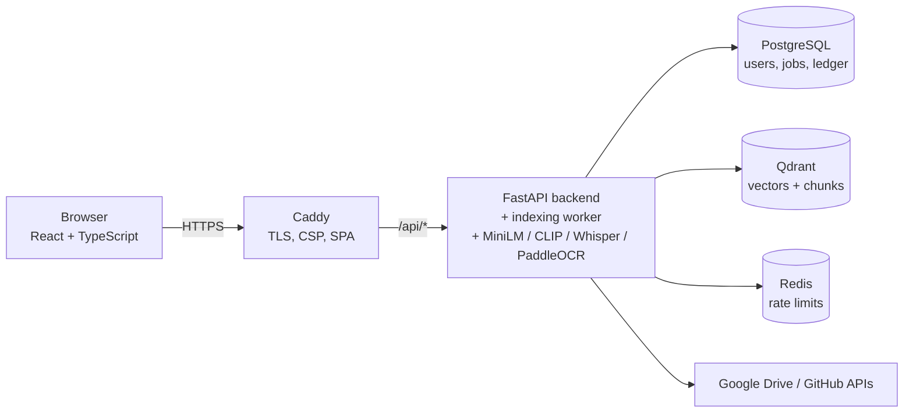

# CogniSeek

[](https://github.com/PranavMahajan02/NeuralSearch/actions/workflows/backend.yml)
[](https://github.com/PranavMahajan02/NeuralSearch/actions/workflows/frontend.yml)
[](https://github.com/PranavMahajan02/NeuralSearch/actions/workflows/security.yml)
[](https://github.com/PranavMahajan02/NeuralSearch/actions/workflows/docker.yml)
[](https://github.com/PranavMahajan02/NeuralSearch/actions/workflows/e2e.yml)
[](LICENSE)

**One search box for everything you own: your laptop's folders, Google Drive and GitHub.**
CogniSeek indexes documents, code, images, audio and video, and lets you search them in plain
language: *"java notes"*, *"polar bear cubs"*, *"invoice from september"*. It finds files by what
they **contain and show**, not only by their names. It combines MiniLM text embeddings, CLIP
image/frame embeddings, Whisper transcripts and OCR with classic file-name matching. Every
threshold is calibrated against a labelled evaluation set, so nonsense queries return nothing.
It is multi-user and self-hosted: each user only ever sees their own files, and OAuth tokens are
encrypted at rest.

## Features

- **Multimodal search:**
  - **Text and code:** PDF (with OCR for scanned pages), DOCX, PPTX, TXT/MD/CSV and source files.
  - **Images:** JPG, PNG, WEBP, AVIF, found by visual content and by text inside them.
  - **Audio and video:** found by what is said (Whisper) and, for video, by what is shown (CLIP on
    one frame every 5 s).
- **Hybrid retrieval:** vector search (Qdrant) plus trigram file-name search (Postgres), merged and
  ranked with calibrated evidence gates. Weaker visual matches appear in a separate "Possible matches"
  list, never mixed into the results.
- **Connectors:**
  - **Local folders.**
  - **Google Drive:** OAuth web flow with state + PKCE, read-only scope.
  - **GitHub:** OAuth, Git Trees API, default branch.
  - Unchanged files are skipped **before download**, and deletions are synced.
- **Indexing that shows its work:**
  - A Postgres job queue and a priority platform during onboarding.
  - Cancel, per-file errors, run history.
  - A **"Where the time went"** breakdown for every job.
- **Security:**
  - Per-user isolation enforced in every query, revocable JWTs and rate limits.
  - Fernet-encrypted OAuth tokens, traversal-safe paths.
  - Strict CSP behind Caddy (HTTPS); data services on an internal network.
  - Encrypted backups, account export and deletion.
- **Engineered and measured:**
  - 470+ backend tests, 73 frontend tests, a Playwright end-to-end test.
  - A search evaluation harness and an indexing benchmark (347 s → 93 s).
  - CI for lint, types, tests, migrations, audits, CodeQL, Docker builds and e2e.

## Screenshots

Captured by `frontend/e2e/screenshots.ts` with a throwaway demo account (sample notes and stock photos only).

| Sign in | Onboarding 1: connect platforms | Onboarding 2: choose the priority platform |
|---|---|---|
|  |  |  |
| **Dashboard while the priority platform indexes** | **Indexing Center (running)** | **Indexing Center (done, dark)** |
|  |  |  |
| **Dashboard** | **Document query (highlighted passage)** | **Visual query "dog" (no query word in the file name)** |
|  |  |  |
| **No results** | **Platforms** | **Platforms (dark)** |
|  |  |  |

Also: [visual query in dark mode](docs/screenshots/search-visual-dog-dark.png),
[mobile (375 px, dark)](docs/screenshots/mobile-dashboard-dark.png), [Indexing Center (light)](docs/screenshots/indexing-center.png).

## Architecture



Only Caddy publishes ports. Postgres, Qdrant and Redis are on an internal Docker network.
Details, sequence diagrams and the data model: [docs/ARCHITECTURE.md](docs/ARCHITECTURE.md).

## Quick start (Docker)

```bash
git clone https://github.com/PranavMahajan02/NeuralSearch.git cogniseek && cd cogniseek
cp .env.example .env
python scripts/generate_secrets.py        # fills every REQUIRED secret; prints key names only
docker compose up -d --build              # first start downloads the AI models (~2 GB)
docker compose ps                         # wait until backend is "healthy"
```

- **Open the app:** **https://localhost** (Caddy's internal CA: accept the certificate warning, or
  run `docker compose exec caddy caddy trust`). Register, then on the Platforms page add
  `/data`: the bundled `sample-data/` folder, mounted read-only.
- **Your own files:** point `LOCAL_DATA_DIR` in `.env` at a folder. It appears as `/data` in the
  backend; folder paths are container paths.
- **Public server:** set `DOMAIN=search.example.com` and `TLS=<your e-mail>` for a Let's Encrypt
  certificate (HSTS on).
- **NVIDIA GPU:** `docker compose -f docker-compose.yml -f docker-compose.gpu.yml up -d --build`
  (needs the NVIDIA Container Toolkit; untested by the maintainer).

Operations (upgrades, backups, key rotation, troubleshooting): [docs/OPERATIONS.md](docs/OPERATIONS.md).

## Development setup (non-Docker)

Postgres and Qdrant run in Docker; the backend and the Vite dev server run on the host.
On Windows, always call tools through the venv's interpreter (`python -m ...`): the `.exe`
launchers of a copied venv point at the original folder.

```powershell
python -m venv venv
venv\Scripts\python -m pip install -r requirements-dev.txt
copy .env.example .env                                # then: python scripts\generate_secrets.py
docker compose -f docker-compose.dev.yml up -d        # postgres :5432 + qdrant :6333 (127.0.0.1 only)
venv\Scripts\python -m alembic upgrade head
venv\Scripts\python -m uvicorn app.main:app --port 8000
cd frontend; npm install; npm run dev                 # http://127.0.0.1:3000 (fails if the port is taken)
```

- **Open the app** at **http://127.0.0.1:3000**. Keep `FRONTEND_URL` on that host: the login token
  is stored per origin, and OAuth returns there.
- **Development mode needs less:** no Redis (in-memory rate limits) and no Qdrant API key.
  Missing JWT/Fernet keys are generated per run, with a warning.
- **Schema changes:** `venv\Scripts\python -m alembic revision --autogenerate -m "<what>"`, review
  the file, then `upgrade head`. `alembic check` must report no pending operations (CI enforces it).
- **Note:** `docker compose up` without `-f` starts the production stack (project `cogniseek`),
  not the development containers.

## Configuration

All settings are environment variables, documented one by one in [`.env.example`](.env.example).
Entries marked **REQUIRED** must be set for the Docker deployment; `scripts/generate_secrets.py`
fills the secrets. Production refuses to start without a strong JWT secret, a valid token-encryption
key, the Qdrant API key and `REDIS_URL`.

## Connecting Google Drive and GitHub (OAuth)

Both connectors use a browser OAuth redirect: the app sends you to Google/GitHub, which sends you
back to the backend callback, which then returns you to the frontend.

| | Development (non-Docker) | Docker deployment |
|---|---|---|
| Google redirect URI | `http://127.0.0.1:8000/platforms/google-drive/callback` | `https://<DOMAIN>/api/platforms/google-drive/callback` |
| GitHub callback URL | `http://127.0.0.1:8000/platforms/github/callback` | `https://<DOMAIN>/api/platforms/github/callback` |

**Google Drive:**
1. Google Cloud console → APIs & Services → Credentials → **OAuth client ID**, type
   **Web application** (a "Desktop app" client does not work).
2. Add the redirect URI above exactly (it must equal `GOOGLE_REDIRECT_URI`).
3. Enable the **Google Drive API**. On the consent screen add the scopes `drive.readonly`, `openid`
   and `userinfo.email`, and add yourself as a test user while the app is in testing.
4. Save the client JSON as `credentials/client_secret.json` (it starts with `{"web": ...}`).
5. When connecting, **tick the Drive checkbox** on Google's consent screen. CogniSeek checks the
   scopes actually granted and refuses a token without Drive access.

**GitHub:**
1. Settings → Developer settings → **OAuth Apps**.
2. Set the callback URL above (`BACKEND_PUBLIC_URL` + `/platforms/github/callback`).
3. Save `{"client_id": "...", "client_secret": "..."}` as `credentials/github_oauth.json`.

Disconnecting revokes the grant at Google/GitHub; you choose whether to also delete the files
already indexed from that platform.

## Running the tests

| What | Command | Notes |
|---|---|---|
| Backend tests | `venv\Scripts\python -m pytest` | 470+ tests; own throwaway Postgres DB per run, in-memory Qdrant, fake embedders (no models, no real Google/GitHub calls) |
| Backend lint/format/types | `ruff check app tests scripts`, `ruff format --check ...`, `python scripts/check_mypy_baseline.py` | mypy fails only on errors not in `mypy-baseline.txt` |
| Frontend | `cd frontend; npm run lint; npm run typecheck; npm run coverage; npm run build` | Vitest + Testing Library + MSW; coverage ≥ 70% |
| End-to-end | `cd frontend; npm run test:e2e` | Playwright against a running backend: register → onboarding → index → search → download → delete account, axe in light/dark, fails on CSP violations. For the Docker stack, set `E2E_BASE_URL=https://localhost`, `E2E_API_URL=https://localhost/api`, `E2E_FILES_ROOT=../sample-data` and `E2E_CONTAINER_ROOT=/data` (prefix `MSYS_NO_PATHCONV=1` in Git Bash) |
| API types | `cd frontend; npm run gen:api` | regenerates `src/api/schema.d.ts` from the backend's OpenAPI |

**CI** (`.github/workflows`):
- `backend.yml`: ruff, mypy baseline, `alembic upgrade head` + `alembic check`, pytest with
  coverage, and startup against real Postgres/Qdrant/Redis.
- `frontend.yml`: lint, typecheck, coverage, build, depcheck.
- `security.yml`: gitleaks (full history), pip-audit + npm audit, CodeQL.
- `docker.yml`: builds all three images.
- `e2e.yml`: the Docker stack + Playwright; nightly and on stack changes.
- Dependabot updates pip, npm, actions and Docker weekly.

## Search quality evaluation

```powershell
venv\Scripts\python scripts\eval_search.py --base-url http://127.0.0.1:8000 --label mine
venv\Scripts\python scripts\compare_eval.py docs\eval\<before>.json docs\eval\<after>.json
```

83 labelled queries over the owner's data. Current results: non-visual P@5 **0.935**, visual-only
images 0.719, visual-only video 0.500, 0 false positives on the non-visual negatives.
Methodology, calibration and history: [docs/EVALUATION.md](docs/EVALUATION.md).

## Performance

- **Benchmark:** 69 files, 211 MB (PDFs, scanned PDFs, Office files, code, 20 images, 8
  audio-minutes, 16 video-minutes) on an RTX 3050 laptop.
- **Result:** **93 s instead of 347 s** (3.7× faster); half the files are searchable after
  **31 s instead of 191 s**.
- **Quality unchanged:** the eval was re-run on indexes built before and after, and no query
  got worse.
- Details, per-stage numbers and the ideas that were measured and rejected:
  [docs/perf/RESULTS.md](docs/perf/RESULTS.md).

**GPU OCR is opt-in and is most of the gain:**
- Enable it with `venv\Scripts\python -m pip uninstall -y paddlepaddle` followed by
  `venv\Scripts\python -m pip install -r requirements-gpu.txt`.
- `OCR_DEVICE=auto` (the default) uses it when present.
- Without it, the default install takes 292 s and is 50% searchable after 69 s.

**Tuning:**
- `INDEX_IO_WORKERS`: files processed at once (default 4; lower it on small machines).
- `INDEX_PREFETCH`: files in flight (default 8).
- Benchmark yourself with `venv\Scripts\python scripts\bench_indexing.py --label mine --runs 2`
  (scratch DB and Qdrant prefix; your data is never touched).

Search: p50 about 0.2 s warm over the eval queries ([docs/FINAL_QA.md](docs/FINAL_QA.md) has the
8-concurrent numbers).

## Known limitations

- **Shared Drives are not indexed.** The Drive connector lists My Drive and the files shared with
  you, not Shared Drives (Team Drives).
- **No query expansion.** "Find my government documents" finds files that contain or are named with
  those words; an ID scan named `scan01.jpg` is found only by a query about its actual content.
- **Visual search is conservative.**
  - About 70% of relevant images and half of the visual-only video queries are found on visual
    evidence alone; short or background details are missed.
  - Photos of documents are found through their OCR text and file name.
  - Near-misses show up in "Possible matches" (at most 3, about 0.5 unrelated items per query on
    average).
- **Video frames** are sampled every 5 s; sampling every 2 s was measured and rejected
  ([phase6d-possible-tier.md](docs/eval/phase6d-possible-tier.md)).
- **Typos:** tolerated in single words ("jva" → "java"); a typo plus an unmatched word may return
  nothing.
- **Small evaluation set:** 83 queries labelled by the owner; see [docs/EVALUATION.md](docs/EVALUATION.md#limits-what-these-numbers-do-not-prove).
- **Security gaps (documented):**
  - Indexed text is not encrypted at rest (use disk encryption).
  - The access token is kept in `localStorage`.
  - See [docs/SECURITY.md](docs/SECURITY.md#known-gaps).
- **One API process** with an in-process indexing worker; it scales vertically.

## Roadmap

- **Google Shared Drives** support.
- **Query expansion / synonyms** ("government documents" → Aadhaar, passport, …).
- **Cookie-based auth:** an `HttpOnly; SameSite=Strict` cookie plus a CSRF token and refresh-token
  rotation.
- **More connectors:** Notion, Slack, OneDrive / SharePoint.
- **Encryption at rest** for indexed text (beyond disk encryption).
- **Separate indexing worker processes** and a GPU pool; Qdrant sharding by user.
- **PaddleOCR 3 / Pillow 12 upgrades** to clear the allowlisted dependency advisories.

## Repository settings (for the maintainer)

Recommended **branch protection for `main`** (GitHub → Settings → Branches → Add rule):
- require a pull request before merging, with 1 approval;
- require the status checks *Lint, migrations, tests* (Backend), *Lint, typecheck, tests, build*
  (Frontend), *gitleaks (full history)*, *pip-audit + npm audit* and *CodeQL (python)* /
  *CodeQL (javascript-typescript)*;
- require branches to be up to date; block force pushes and deletions.

## Documentation

| Document | What it covers |
|---|---|
| [docs/PROJECT_GUIDE.md](docs/PROJECT_GUIDE.md) ([PDF](docs/CogniSeek_Project_Guide.pdf)) | A narrative tour of the whole system |
| [docs/ARCHITECTURE.md](docs/ARCHITECTURE.md) | Components, sequence diagrams, data model, design decisions |
| [docs/SECURITY.md](docs/SECURITY.md) | Threat model, controls, known gaps, key rotation, disclosure |
| [docs/EVALUATION.md](docs/EVALUATION.md) | Search quality: method, numbers, calibration, history |
| [docs/OPERATIONS.md](docs/OPERATIONS.md) | Deploy, upgrade, backups, rotation, logs/metrics, troubleshooting |
| [docs/perf/RESULTS.md](docs/perf/RESULTS.md) | Indexing performance study |
| [docs/FINAL_QA.md](docs/FINAL_QA.md) | The final audit: before → after |
| [docs/REMEDIATION_SUMMARY.md](docs/REMEDIATION_SUMMARY.md) | Every audit finding → fix, commit and test |
| [docs/INTERVIEW_QA.md](docs/INTERVIEW_QA.md), [docs/DEMO_SCRIPT.md](docs/DEMO_SCRIPT.md) | Interview preparation and a 5-minute demo |
| [CHANGELOG.md](CHANGELOG.md), [docs/RELEASE_NOTES_v1.0.0.md](docs/RELEASE_NOTES_v1.0.0.md) | Release notes |

## License

[MIT](LICENSE)
