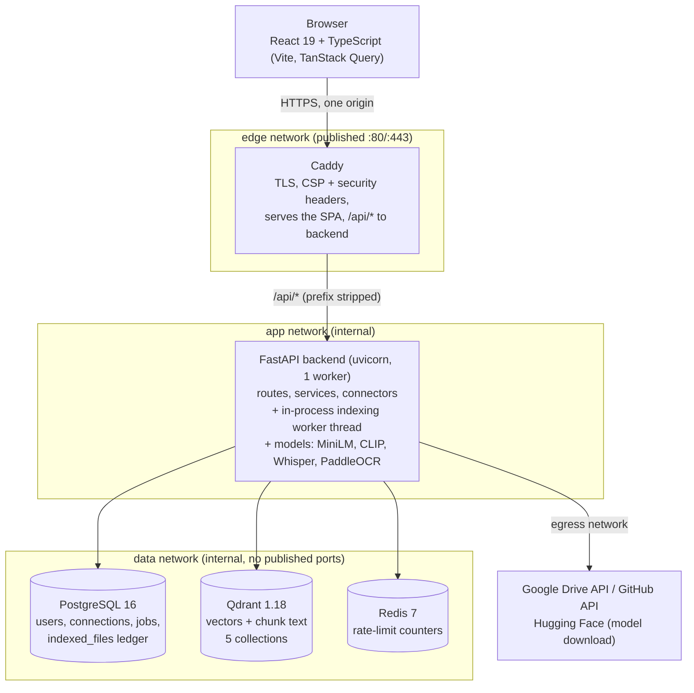
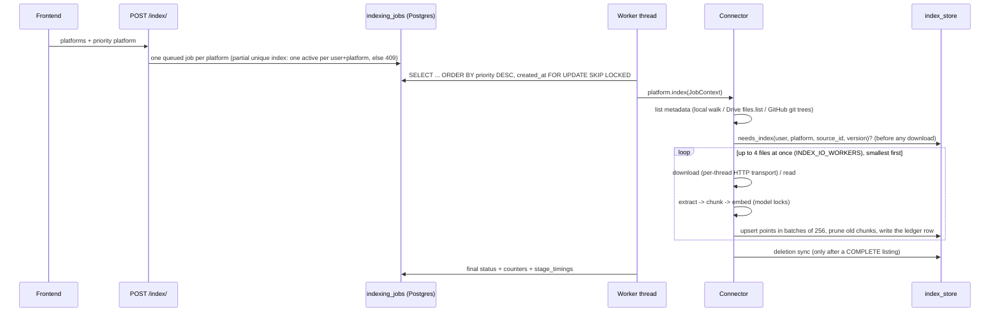
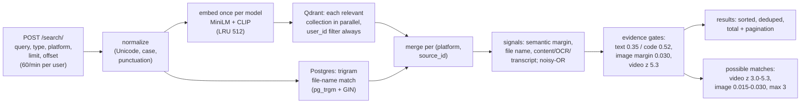
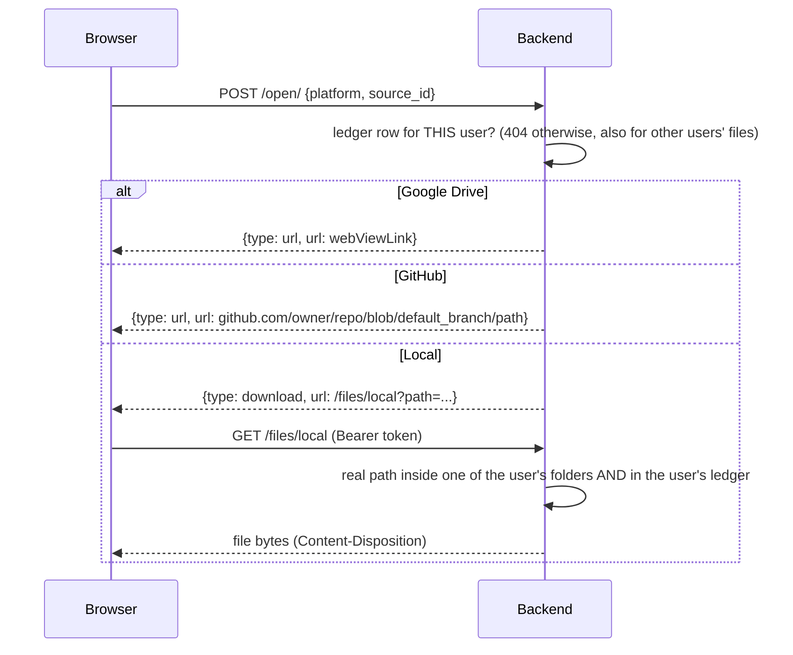

# Architecture

CogniSeek indexes a user's files from local folders, Google Drive and GitHub, and lets the user
search across all of them by meaning (text, code, images, audio, video). This document describes
the components, the main request flows, the data model and the design decisions. For a gentler,
narrative tour see [PROJECT_GUIDE.md](PROJECT_GUIDE.md).

## Components



| Component | Code | Responsibility |
|---|---|---|
| Frontend | `frontend/src` | Pages (login, onboarding, dashboard/search, platforms, indexing center, account), typed API client generated from OpenAPI, TanStack Query for server state |
| Caddy | `deploy/caddy` | The only public entry point: TLS (internal CA on localhost, Let's Encrypt for a domain), strict CSP, HSTS, `/api/metrics` blocked |
| Routes | `app/routes`, `app/auth` | HTTP layer: validation (Pydantic), `get_current_user` on every non-public route, rate limits |
| Services | `app/services` | Search, indexing pipeline, `index_store` (the only writer to Qdrant and the ledger), account, dashboard, open/download |
| Connectors | `app/platforms` | Local, Google Drive, GitHub; the shared sync loop, the parallel file loop, HTTP retries |
| Extractors / indexers | `app/extractors`, `app/services/indexers` | Text, OCR, PDF rendering, video frames, transcripts → points |
| Search | `app/search` | Retrieval, calibration, ranking, the possible-matches tier |
| Vector store | `app/vectorstore` | Qdrant client, schema, **the single query function** (refuses to run without `user_id`) |
| Scheduler | `app/scheduler` | Job queue (Postgres), the worker thread, `JobContext` |
| Core | `app/core` | Config, crypto (Fernet), paths, rate limiting, headers, logging, request ids, metrics, timing |

## Login

```mermaid
sequenceDiagram
    participant B as Browser
    participant A as /auth/login
    participant DB as Postgres
    B->>A: email + password (rate limit 5/min per IP)
    A->>DB: user by e-mail (lower-cased)
    A->>A: bcrypt verify (same error for unknown e-mail or wrong password)
    A-->>B: JWT HS256 {user_id, tv, jti, iat, exp = 60 min}
    Note over B: token kept in localStorage, sent as Authorization: Bearer
    B->>A: any API call
    A->>A: verify signature + expiry
    A->>DB: user by id; tv == token_version?
    A-->>B: 401 if missing / invalid / revoked
```

Logout, password change and account deletion bump `token_version`, which revokes every token
issued before, without a blacklist.

## OAuth connect (Google Drive: state + PKCE)

```mermaid
sequenceDiagram
    participant B as Browser
    participant API as Backend
    participant DB as Postgres
    participant G as Google
    B->>API: GET /platforms/google-drive/connect (JWT)
    API->>API: state = token_urlsafe(32), PKCE code_verifier
    API->>DB: oauth_states(state, user_id, verifier, expires +10 min, used=false)
    API-->>B: authorization URL (code_challenge = SHA256(verifier))
    B->>G: consent (drive.readonly, openid, email)
    G-->>B: redirect to /platforms/google-drive/callback?code&state
    B->>API: callback (no JWT: a browser redirect)
    API->>DB: state exists, unexpired, unused, platform matches -> mark used; user_id from the row
    API->>G: exchange code + verifier
    API->>API: drive.readonly actually GRANTED? (per-scope checkbox)
    API->>DB: tokens Fernet-encrypted, account e-mail
    API-->>B: 303 to FRONTEND_URL/?google_drive=connected
```

GitHub uses the same single-use state (scopes `repo read:user`); this implementation does not add
PKCE to the GitHub flow. Disconnect revokes the grant at the provider, then deletes the local tokens (optionally
purging the indexed files).

## Indexing



**Change detection:** the ledger stores each file's version:
- local: mtime;
- Drive: `modifiedTime|md5Checksum`;
- GitHub: the blob SHA.

Unchanged files are skipped before any download, so a second run on unchanged Drive/GitHub
downloads 0 files. Files that yield no content, unsupported files and excluded files are
recorded too, so they are not retried every run.

**Parallel pipeline:**
- `process_files` runs up to 4 files at once with at most 8 in flight.
- Each model keeps its own lock (one call at a time per model; different models may overlap,
  which measured fastest).
- Per-file errors are isolated, and cancel stops new files from starting.
- A 429 from a connector pauses every parallel request (`CooldownGate`).
- Drive and GitHub use one HTTP transport per thread: `httplib2` is not thread-safe.

**Per file type:**
- **Documents:** text extraction. PDF pages that are scanned, noisy or at least 40% image are
  OCR'd (max 20 pages), then chunked (1,000 characters) and MiniLM-embedded.
- **Images:** a CLIP vector plus OCR text.
- **Audio:** a Whisper transcript (VAD), chunked (500 characters), MiniLM.
- **Video:** the transcript as above, plus one frame every 5 s (seek per frame), CLIP batched 32 at
  a time, and the per-video null stored on every frame point.

## Search



Every vector query goes through `app/vectorstore/query.py`, which raises `MissingUserScope` without
a `user_id` and always adds the user filter. Calibration details: [EVALUATION.md](EVALUATION.md).

## Open / download



Nothing is opened or executed on the server.

## Data model

### PostgreSQL (15 migrations, `alembic/versions`)

| Table | Key columns | Notes |
|---|---|---|
| `users` | id (UUID), email (unique), full_name, password_hash, token_version, onboarding_completed | |
| `platform_connections` | user_id, platform, account_email, account_name, access_token\*, refresh_token\*, token_json\*, connected | \* Fernet-encrypted (`EncryptedText`) |
| `oauth_states` | state (PK), user_id, platform, code_verifier, expires_at, used | single use, 10 minutes |
| `local_storage_folders` | user_id, folder_path | unique (user_id, folder_path) |
| `indexing_jobs` | user_id, platform, status, priority, counters, current_file, cancel_requested, heartbeat_at, stage_timings (JSONB) | one active job per user+platform (partial unique index) |
| `indexing_job_errors` | job_id, file_ref, error | sanitized, max 200 per job |
| `indexed_files` | user_id, platform, source_id, version, status, file_type, chunk_count, size, modified_at, mime_type, owner/repo/default_branch, web_view_link | **the ledger**; unique (user_id, platform, source_id); trigram index on file_name |
| `indexing_history` | | legacy table from the baseline schema, unused by the code |

All timestamps are `timestamptz` (UTC).

### Qdrant

Five collections, named `<QDRANT_COLLECTION_PREFIX>_<kind>` (`cogniseek_v2_*` by default):

| Collection | Vector | Points |
|---|---|---|
| `text` | 384-d MiniLM, cosine | document and code chunks |
| `image` | 512-d CLIP, cosine | one per image (OCR text in `chunk`) |
| `audio` | 384-d MiniLM | transcript chunks |
| `video` | 384-d MiniLM | transcript chunks |
| `video_frames` | 512-d CLIP | one per sampled frame |

**Payload:** `user_id`, `platform`, `source_id`, `file`, `path`, `type`, `version`, `chunk_index`,
`chunk` (the text), plus:
- `frame_number`, `frame_time_s`, `null_mean` and `null_std` for frames;
- `owner` and `repo` for GitHub.

Keyword payload indexes on `user_id`, `platform`, `source_id` and `type`, and an integer index on
`chunk_index`.

**Point ids are deterministic:** `uuid5(user | platform | source_id | type | chunk | frame)`. Re-indexing
a file overwrites its points. New points are written first and old chunks pruned afterwards, so a
concurrent search never sees a file with zero vectors.

## Design decisions and trade-offs

| Decision | Why | Trade-off |
|---|---|---|
| **Qdrant for vectors + a Postgres ledger for per-file facts** | Qdrant does filtered nearest-neighbour search; versions, statuses, counts and ownership are relational. The original kept the same data in pickles *and* Qdrant, and they drifted (ghost results). | Two stores to keep consistent; `index_store` is the only writer of both. |
| **Shared collections filtered by `user_id`** (not a collection per user) | Standard multi-tenant pattern; the indexed filter is cheap; one choke-point function enforces it | A filter bug would be a cross-tenant leak, hence the single query function and cross-user tests |
| **Deterministic point ids** | Re-indexing overwrites instead of duplicating; upsert-then-prune keeps search consistent | Ids depend on the identity scheme (changing it means a migration) |
| **Job queue in Postgres (`FOR UPDATE SKIP LOCKED`)** | Transactions, a partial unique index for "one active job", no extra broker | Polling (5 s, woken on enqueue) instead of push |
| **One uvicorn worker, worker thread in-process** | Models (GPU memory) loaded once; one queue consumer | Vertical scaling only; separate worker processes are the next step |
| **Parallel files, per-model locks** | A/B on the benchmark: parallel + per-model locks 92.8 s, one shared GPU lock 115.1 s, sequential 121.6 s | More peak RAM with CPU OCR (4.8 GB); `INDEX_IO_WORKERS` is tunable |
| **Calibrated margins instead of raw thresholds** | Raw CLIP/MiniLM scores are query-dependent; margins over neutral prompts and a per-video null transfer across queries/videos | Thresholds are fitted on a small owner-labelled set |
| **Possible-matches tier** | Shows near-misses without polluting results or counts | About 0.5 unrelated items per query in that tier |
| **Reverse proxy + same origin** | One TLS endpoint, strict CSP, no browser CORS in production, internal-only data services | Development uses CORS (Vite on :3000) |
| **JWT in localStorage + token_version** | No CSRF surface; instant server-side revocation | XSS could read the token: mitigated by CSP; cookie + CSRF is future work |
| **Fernet for OAuth tokens** | Authenticated encryption, simple key handling | Indexed text is not encrypted at rest (disk encryption recommended) |
| **Profile before optimizing** | OCR was 61% of indexing time with the GPU 86% idle; fixing that gave 347 s → 93 s | GPU OCR is opt-in (extra Paddle CUDA build) |
| **Health vs readiness** | `/health` restarts a dead process; `/ready` (DB, Qdrant, Redis, models) gates traffic | A model download delays readiness on first start |
