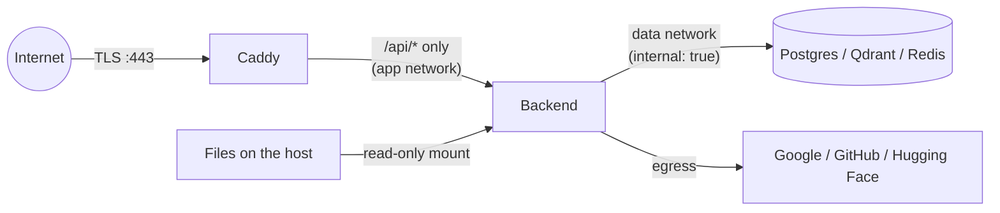

# Security

How CogniSeek protects its users' data: what we protect, from whom, the controls, the known gaps
and the operational procedures. It covers the Docker deployment (`docker-compose.yml`); the
development setup is in the README. Vulnerability reports: see [Responsible disclosure](#responsible-disclosure).

## Threat model

### Assets

| Asset | Where | Why it matters |
|---|---|---|
| Indexed content: text chunks, OCR text, transcripts, file names/paths | Qdrant payloads, Postgres `indexed_files` | Can contain personal documents (IDs, certificates, finances) |
| Embeddings | Qdrant | Derived from the content; partially invertible in principle |
| Google Drive / GitHub OAuth tokens | `platform_connections` (Fernet-encrypted) | Read access to the user's whole Drive / private repos |
| User credentials and sessions | bcrypt hashes; JWTs in the browser | Account takeover |
| The user's local files | Mounted read-only at `/data`; uploads volume | Original data |
| Secrets | `.env`, `credentials/` | JWT signing, token encryption, DB/Qdrant/Redis access, backups |
| Backups | `./backups/*.tar.enc` | A full copy of the above |

### Actors

1. **Anonymous internet user:** can reach Caddy on 80/443 only.
2. **Another registered user:** a valid account, trying to read or change someone else's data.
3. **Malicious web page:** in the victim's browser (CSRF, login-CSRF on OAuth, clickjacking).
4. **Malicious file content:** a crafted PDF, image or video that a user indexes.
5. **Someone with a copy of the database or a backup**, without the keys.
6. **A compromised dependency or a leaked secret in git.**

### Trust boundaries



1. **Browser ↔ Caddy:** everything from the browser is untrusted. The JWT identifies the user,
   and the request body never does.
2. **Caddy ↔ backend:** only Caddy can reach the backend. `X-Forwarded-For` is trusted for
   rate-limit keys because of that.
3. **Backend ↔ data services:** they sit on an internal Docker network with no published ports,
   each protected by its own credentials.
4. **Backend ↔ providers:** OAuth with state (+ PKCE for Google), read-only scopes, and
   responses treated as untrusted.
5. **Backend ↔ file content:** extracted, never executed. Decoders run in an unprivileged
   container.

## Controls mapped to threats

| Threat | Controls | Evidence |
|---|---|---|
| Unauthenticated access to the API | `get_current_user` on every route except register, login, `/`, health/ready and OAuth callbacks | `tests/test_auth_required.py` walks every route in the OpenAPI schema and expects 401 |
| Reading another user's data (IDOR) | `user_id` only from the verified JWT; every vector query through `app/vectorstore/query.py` (refuses to run without `user_id`); every SQL query filtered by user; open/download require a ledger row of **this** user (404 otherwise) | Cross-user tests in `tests/test_index_v2.py`, `tests/test_files.py`; FINAL_QA probes |
| Password guessing / credential stuffing | bcrypt; 5 attempts/min per IP on login and register (Redis-backed); identical error for unknown e-mail and wrong password | `tests/test_auth.py`, `tests/test_rate_limits.py` |
| Stolen / long-lived session | 60-minute JWT; `token_version` bumped on logout, password change and deletion revokes every older token at once | `tests/test_auth.py`, `tests/test_account.py` |
| CSRF | No cookies: the token is sent explicitly as `Authorization: Bearer`, so a foreign page cannot ride the session | Design |
| OAuth login-CSRF / code theft | Random, single-use, 10-minute `state` bound to the user in the DB; PKCE `code_verifier` for Google; the user comes from the state row, never the URL | `tests/test_oauth_and_tokens.py`, `tests/test_connectors.py` |
| Over-broad provider access | Drive `drive.readonly` only; the **granted** scopes are checked at the callback; grants revoked at the provider on disconnect / deletion | `tests/test_connectors.py` |
| Database or backup copy leaks | OAuth tokens Fernet-encrypted (AES-128-CBC + HMAC); backups encrypted in authenticated chunks; the app DB role is not a superuser | `tests/test_oauth_and_tokens.py`, `tests/test_backup.py` |
| Path traversal / arbitrary file access | `resolve_safe` resolves symlinks, repeated URL-decoding, drive letters and UNC paths, and requires the result inside the allowed base; folders must be inside `ALLOWED_LOCAL_ROOTS` and not a drive root | `tests/test_paths.py` (15 cases), `tests/test_files.py` |
| Server-side code execution via files | Nothing is opened or executed on the server (the original `os.startfile` was removed); uploads are extension-checked, size-limited and stored per user | `tests/test_files.py` |
| XSS | React escaping, no `dangerouslySetInnerHTML`; highlights built from text ranges; strict CSP (no inline script, no third-party origins; fonts self-hosted) | `tests/test_deploy.py`; the Playwright test fails on any CSP violation |
| Clickjacking / sniffing / referrer leaks | `frame-ancestors 'none'`, `X-Frame-Options: DENY`, `nosniff`, `Referrer-Policy: no-referrer`, `Permissions-Policy`, COOP/CORP | `tests/test_deploy.py` |
| Network exposure of data services | Only Caddy publishes ports; data services on an `internal: true` network; Qdrant API key; Redis password; HTTPS with HSTS on real domains | `tests/test_deploy.py` (compose invariants) |
| Secrets in logs or error messages | Log filter redacts bearer tokens, JWTs, provider token literals, `code`/`state`/`password` pairs (also in tracebacks); user-facing errors sanitized | `tests/test_observability.py`, `tests/test_errors_and_headers.py` |
| Secrets in git | `.env`/`credentials/` git-ignored and outside the Docker build context; gitleaks on the full history in CI; the history was scrubbed once in Phase 0 and the leaked token revoked | `security.yml` |
| Vulnerable dependencies | pip-audit + npm audit in CI (fail on HIGH/CRITICAL not allowlisted); Dependabot weekly; CodeQL | `security.yml`, `.github/dependabot.yml` |
| Abuse / resource exhaustion | Search 60/min per user; OAuth 10/min; upload size limit; per-file text and chunk limits; download size limit (200 MB) | `tests/test_rate_limits.py`, `tests/test_large_files.py` |

### Content Security Policy

```
default-src 'self'; script-src 'self'; style-src 'self'; img-src 'self' data: blob:;
font-src 'self'; connect-src 'self'; object-src 'none'; base-uri 'none';
form-action 'self'; frame-ancestors 'none'; upgrade-insecure-requests
```

The production build has a single `<script type="module" src=…>` and no inline scripts or styles.
Vite is configured never to inline assets as `data:` URIs.

### Why the JWT is in localStorage (and not a cookie)

**Known gap, deliberately accepted.**
- **Why it's acceptable:** a token sent explicitly as a header gives no CSRF surface.
- **The risk is XSS:** script running in our origin could read the token. It is mitigated by the
  strict CSP, React escaping and 60-minute, server-revocable tokens.

**Planned (not implemented):** move the token to an `HttpOnly; Secure; SameSite=Strict` cookie
scoped to `/api`, add a double-submit CSRF token checked on every non-GET request, and add
refresh-token rotation. The same-origin deployment behind Caddy already allows this without CORS
changes.

## Known gaps

1. **Indexed text is not encrypted at rest in Postgres/Qdrant** (only OAuth tokens are).
   - Application-level encryption of vectors would break similarity search.
   - **Mitigation:** encrypt the Docker volumes or disks (BitLocker, LUKS, or the cloud provider's
     disk encryption). The data services are unreachable from outside.
2. **JWT in localStorage** (above).
3. **No per-user quotas** beyond rate limits; a user can index as much as the server's disk allows.
4. **Malicious media files:** decoding relies on OpenCV, Pillow, Poppler, FFmpeg and Paddle.
   - Some have allowlisted advisories (below).
   - Indexing runs as an unprivileged user with read-only access to `/data`, but not in a separate
     sandbox process.
5. **Single-tenant operator trust:** whoever runs the server (and its `.env`) can read everything.
   This is a self-hosted tool, not a zero-knowledge service.

## Your data

- **Export** (`GET /auth/export`, Account settings → Export my data): includes the profile,
  connected accounts (names only), folders, jobs and the file list. It never contains tokens,
  password hashes, vectors or file contents.
- **Delete account** (`DELETE /auth/account`, password + typed confirmation in the UI) removes,
  in order:
  1. the Drive/GitHub grants, revoked at the provider;
  2. every vector of the user in every collection;
  3. the ledger, jobs, folders, connections and uploads;
  4. the user row.

  Sessions die immediately. Earlier backups keep the data until they age out (`BACKUP_KEEP`).
- **Change password** (`POST /auth/change-password`): same policy as registration; signs out every session.

## Secrets and rotation

`python scripts/generate_secrets.py` fills every empty REQUIRED secret in `.env`. It never
overwrites an existing value, never prints one and sets the file to mode 600. Production refuses
to start without a strong `JWT_SECRET_KEY`, a valid `TOKEN_ENCRYPTION_KEY`, `QDRANT_API_KEY` and
`REDIS_URL`.

| Secret | How to rotate | Effect |
|---|---|---|
| `JWT_SECRET_KEY` | Set a new value (≥ 32 random characters), restart | Every session ends; users log in again |
| `TOKEN_ENCRYPTION_KEY` | Re-encrypt first: `scripts/rotate_token_key.py` (old and new key from the environment, `--dry-run` first, one transaction, verified), then set the new key and restart | None for users; **changing the key without re-encrypting** makes every stored Drive/GitHub token unreadable (users would have to reconnect) |
| `QDRANT_API_KEY` | Set the new value in `.env` (used by both the Qdrant service and the backend), `docker compose up -d` (recreates both) | Brief restart |
| `POSTGRES_PASSWORD` (app role) | `ALTER ROLE cogniseek PASSWORD '...'` as the superuser, update `.env`, restart the backend | Brief restart |
| `REDIS_PASSWORD` | Update `.env`, `docker compose up -d` | Rate-limit counters reset |
| Google / GitHub OAuth client secrets | Create a new secret in the provider console, replace `credentials/*.json`, restart; delete the old secret | Existing user grants keep working |
| `BACKUP_ENCRYPTION_KEY` | Set a new key for **new** backups; keep the old key as long as old archives are kept | Old archives need the old key |

**After a demo period or any suspected leak**, rotate at least `JWT_SECRET_KEY`, the OAuth client
secrets and the Qdrant/Redis/DB passwords. Then revoke the demo account's grants at
https://myaccount.google.com/permissions and https://github.com/settings/applications.

Step-by-step commands are in [OPERATIONS.md](OPERATIONS.md#key-rotation).

## Backups

- **Command:** `docker compose run --rm backup` writes `pg_dump` plus a snapshot of every
  Qdrant collection into one tar, with SHA-256 checksums in a manifest.
- **Encryption:** the tar is encrypted with `BACKUP_ENCRYPTION_KEY` (Fernet) in authenticated
  8 MiB chunks. Each chunk carries its index and a "last" flag, so a truncated, reordered or
  modified archive is rejected.
- **Retention:** files are mode 600, and only the newest `BACKUP_KEEP` (default 14) are kept.
- **Key custody:** store the key in a password manager, separate from the archives.
- **Restore testing:** `scripts/restore.py --dry-run` verifies an archive without writing. A
  scratch restore (`--database-url …/restore_check --create-database --target-prefix restorecheck`)
  checks the point counts. Restoring onto the live names requires `--yes`.

## Dependency audit

CI (`security.yml`) runs `scripts/audit_python.py`: pip-audit on `backend/requirements-linux.lock`,
with severities from OSV. It fails on HIGH/CRITICAL advisories that are not in
[`security/audit-allowlist.json`](../security/audit-allowlist.json). `npm audit --audit-level=high`
covers the frontend (currently 0 vulnerabilities).

**Allowlisted (each one needs a row here):**

| Package | Why it is not upgraded yet | Exposure |
|---|---|---|
| `transformers` 4.49.0 | Fixes are in 4.50–5.x. Upgrading changes model loading/preprocessing and must be re-validated against the calibrated search gates. | Models load only from pinned Hugging Face repos at startup; no user-supplied model files, no `trust_remote_code`. |
| `pillow` 11.3.0 | `moviepy` 2.2.1 requires `pillow<12`; the fixes are in 12.x. | Decoding of user images. Plan: replace moviepy (only the fallback for video audio) with direct ffmpeg calls, then upgrade. |
| `opencv-python(-contrib)` 4.6.0.66 | `paddleocr` 2.7.3 requires `<=4.6.0.66`. | Decoding of user images/video. |
| `paddlepaddle` 2.6.2 | The fix is in 3.0, which needs the PaddleOCR 3 migration. | OCR of user images/PDF pages. |
| `python-jose` 3.5.0 / `ecdsa` 0.19.2 | No fixed release. The advisories concern ECDSA; we only use HS256. | Not reachable. Plan: switch to PyJWT. |
| `setuptools` 81.0.0 | One advisory is fixed in 83, but torch 2.11 requires `setuptools<82`. | Build tool; not used at runtime. |
| `imgaug` 0.4.0 | No fixed release; a `paddleocr` dependency for training-time augmentation. | Not called at runtime. |

### Updating the Docker lock file

`requirements.txt` is the Windows dev venv freeze and cannot be installed on Linux.
`backend/requirements-linux.lock` is resolved from `requirements.in` inside `python:3.12-slim` with
CPU torch:

```bash
docker run --rm -v "$PWD:/w" -w /w python:3.12-slim sh -c '
  apt-get update && apt-get install -y build-essential &&
  python -m venv /v && . /v/bin/activate &&
  pip install --index-url https://download.pytorch.org/whl/cpu torch==<ver> torchvision torchaudio &&
  grep -vE "^torch==|^--extra-index-url" requirements.in > /tmp/req.in && pip install -r /tmp/req.in &&
  pip check && pip freeze --exclude torch --exclude torchvision --exclude torchaudio'
```

Keep `av==17.1.0`: PyAV 19 removed an argument faster-whisper 1.2.1 passes, which breaks every
audio/video transcription (a test guards this).

## Responsible disclosure

Please do **not** open a public issue for a vulnerability. Report it privately:
- through GitHub's **"Report a vulnerability"** (Security → Advisories) on the repository, or
- by e-mail to the maintainer (the address in the git history).

Include the steps to reproduce and the impact. You should get an answer within 7 days. A fix and
an advisory follow for confirmed issues, and we will credit you unless you prefer otherwise. Please
test only against your own deployment, never against other people's data.
